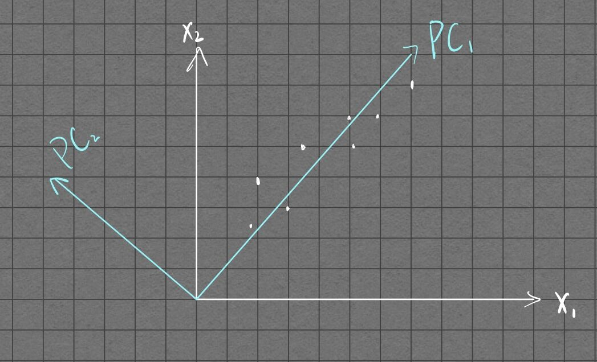

#  引言
写这篇blog只是分享一下个人对于PCA的直观理解，并不涉及严谨的数学推导，懒是一个原因，而且自己对线性代数的SVD那些知识掌握得还不够熟练，这里就不班门弄斧了。

#  降维的思想
要了解某个物体，我们往往会关注它的多个特性（或者叫多个维度）。假设这里有n个特性，那么对于每一个样本，我们可以用n维空间的某一个点来表示：

 $$(x_1, x_2 , \dots, x_n)$$

然而，这些特性中，会存在某一些高度相关的特性，比如在评价一个人时，他/她的总财产和月收入一般是正相关的，那么我们是否可以只用一个数来描述这个人的富有程度呢？显然是可以的。事实上，这样的想法就基本上是降维的思路了。如果按照上述例子的思路，我们就可以把一个n维空间的点，变成一个n-1维空间的点了。

#  主成分分析
事实上，主成分分析的实质就是**坐标轴的变换**，然后舍弃掉贡献较小的变量。

在这里提一下，很多教程喜欢把中心化(centralizing)放在前面讲，但事实上这个操作只是把坐标原点进行平移而已，并不涉及PCA的实质，暂且不提。

如上图所示，我们用了新的一组变量$(PC_1 , PC_2)$来代替原来的变量$(x_1, x_2)$。显然，在新的坐标下，数据点在$PC_2$方向上的分散较小，若在误差范围内，可以忽略。这样，我们就可以只用$PC_1$一个变量来描述这些数据点了。

根据线性代数的知识，我们可以知道这里其实就涉及到基变换的知识了。同样地，这也是个非常“数学”的过程，等以后有时间再写。简单来说，新的变量组是旧变量组的线性组合。

#  另一种看法
不难发现，上述对于PCA的理解其实有点类似Linear Regression。现在我们用另外一种角度来考虑PCA。前面提到，新的变量组是旧变量组的线性组合，那就可以写成如下格式：

$$
\begin{cases}  PC_1 = c_{11}x_1 + c_{12}x_2 + \dots +c_{1n}x_n \\
PC_2 = c_{21}x_1 + c_{22}x_2 + \dots +c_{2n}x_n \\ \vdots \\
PC_n = c_{n1}x_1 + c_{n2}x_2 + \dots +c_{nn}x_n
\end{cases}
$$

问题是系数$c_{ii}$的选取，以什么作为原则呢？因为我们最终目的是降维，也就是说要把尽量多的**特征**保留在前几个主成分中。这意味着什么呢？如果两个点投影到一个轴上之后重合成一个点，那么这两个点的区分度就变小了，也就是说，在降维之后，用于描述这两个点的特征变少了。那么直观上怎么样才算是保留了较多的**特征**呢？事实上， 这就是要求样本点在新的轴上的分布尽量分散。很容易联想到，描述样本分散程度的数学量就是方差。所以我们要做的事情也就是使$Var(PC_1)$最大化。

这两种看法实际上是一样的，设样本点到新坐标轴的距离为$h$，点 $\overline{x}$ 的坐标为$(\overline{x_1}, \overline{x_2}, \dots, \overline{x
_n})$，样本点在新坐标轴上的投影到点 $\overline{x}$ 的距离为$d$。因为样本点到点 $\overline{x}$ 点的距离是一定的，那么根据勾股定理，如果我们要求$h$尽量小，实际上等价于要求$d$尽量大。

上述的证明默认了新的坐标轴是经过点 $\overline{x}$ 的，其实这也就是中心化。

#  碎碎念
PCA的数学公式推导暂且先留个坑，希望以后会有时间搞一搞。不得不说孔子讲得还真对，温故而知新。线性代数这门学科越是反复看就越是觉得有意思，当然也确实有点难度，等到一切尘埃落定之后会好好整理一下这些知识。
