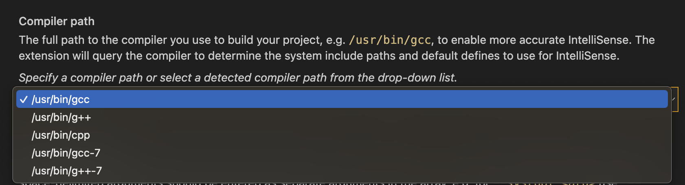

The error message is like

```xml
cannot open source file "iostream". Please run the 'Select IntelliSense Configuration...' command to locate your system headers.
```


1. Click the bulb beside the error line
    
    

    
2. Click `Edit “compilerPath” setting`
3. Select one from the list
    
    
    

Now the problem should be fixed.